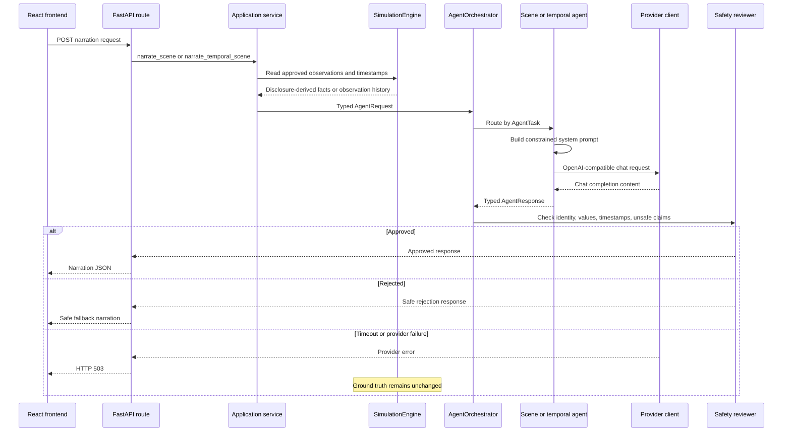

# Narration workflow

The workflow shows normal narration and failure isolation. Provider failure returns an API error; it does not call simulator mutation methods.

```mermaid
sequenceDiagram
  participant UI as React frontend
  participant API as FastAPI route
  participant APP as Application service
  participant SIM as SimulationEngine
  participant ORCH as AgentOrchestrator
  participant AGENT as Scene or temporal agent
  participant PROVIDER as Provider client
  participant REVIEW as Safety reviewer

  UI->>API: POST narration request
  API->>APP: narrate_scene or narrate_temporal_scene
  APP->>SIM: Read approved observations and timestamps
  SIM-->>APP: Disclosure-derived facts or observation history
  APP->>ORCH: Typed AgentRequest
  ORCH->>AGENT: Route by AgentTask
  AGENT->>AGENT: Build constrained system prompt
  AGENT->>PROVIDER: OpenAI-compatible chat request
  PROVIDER-->>AGENT: Chat completion content
  AGENT-->>ORCH: Typed AgentResponse
  ORCH->>REVIEW: Check identity, values, timestamps, unsafe claims
  alt Approved
    REVIEW-->>API: Approved response
    API-->>UI: Narration JSON
  else Rejected
    REVIEW-->>API: Safe rejection response
    API-->>UI: Safe fallback narration
  else Timeout or provider failure
    PROVIDER-->>API: Provider error
    API-->>UI: HTTP 503
    Note over SIM: Ground truth remains unchanged
  end
```
