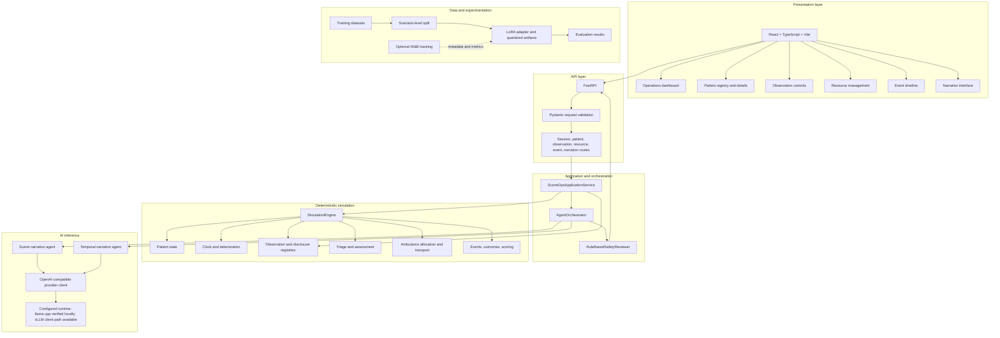

# System overview

SceneOps separates deterministic simulation from language generation.

```mermaid
flowchart TB
  subgraph P[Presentation layer]
    UI[React + TypeScript + Vite]
    DASH[Operations dashboard]
    REG[Patient registry and details]
    OBS[Observation controls]
    RES[Resource management]
    EVT[Event timeline]
    NAR[Narration interface]
    UI --> DASH
    UI --> REG
    UI --> OBS
    UI --> RES
    UI --> EVT
    UI --> NAR
  end

  subgraph A[API layer]
    FAST[FastAPI]
    VAL[Pydantic request validation]
    SESS[Session, patient, observation, resource, event, narration routes]
    FAST --> VAL --> SESS
  end

  subgraph O[Application and orchestration]
    APP[SceneOpsApplicationService]
    ORCH[AgentOrchestrator]
    REVIEW[RuleBasedSafetyReviewer]
    APP --> ORCH --> REVIEW
  end

  subgraph S[Deterministic simulation]
    ENGINE[SimulationEngine]
    PAT[Patient state]
    CLOCK[Clock and deterioration]
    OBSREG[Observation and disclosure registries]
    TRIAGE[Triage and assessment]
    RESOURCE[Ambulance allocation and transport]
    SCORE[Events, outcomes, scoring]
    ENGINE --> PAT
    ENGINE --> CLOCK
    ENGINE --> OBSREG
    ENGINE --> TRIAGE
    ENGINE --> RESOURCE
    ENGINE --> SCORE
  end

  subgraph I[AI inference]
    SCENE[Scene narration agent]
    TEMP[Temporal narration agent]
    CLIENT[OpenAI-compatible provider client]
    RUNTIME[Configured runtime: llama.cpp verified locally; vLLM client path available]
    SCENE --> CLIENT
    TEMP --> CLIENT
    CLIENT --> RUNTIME
  end

  subgraph D[Data and experimentation]
    DATA[Training datasets]
    SPLIT[Scenario-level split]
    ADAPTER[LoRA adapter and quantized artifacts]
    EVAL[Evaluation results]
    WANDB[Optional W&B tracking]
    DATA --> SPLIT --> ADAPTER --> EVAL
    WANDB -. metadata and metrics .-> ADAPTER
  end

  UI --> FAST
  SESS --> APP
  APP --> ENGINE
  APP --> OBSREG
  ORCH --> SCENE
  ORCH --> TEMP
  REVIEW --> FAST
```
